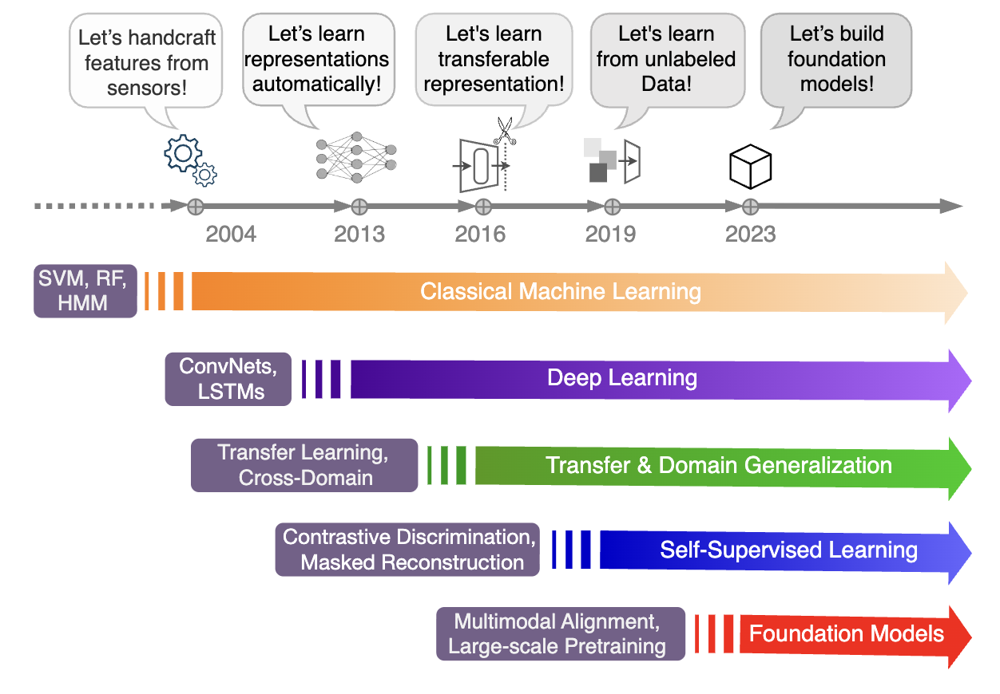
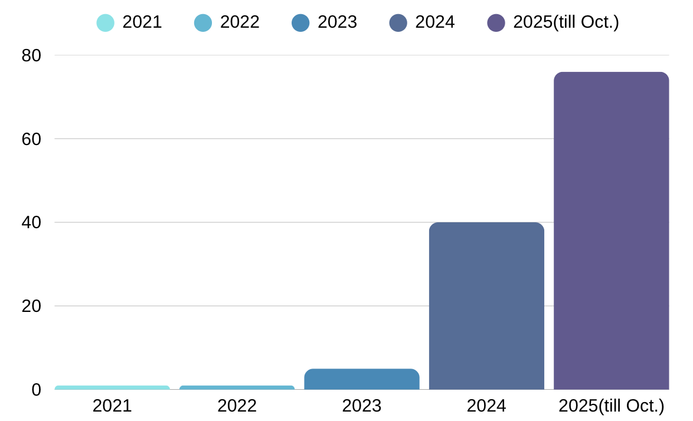
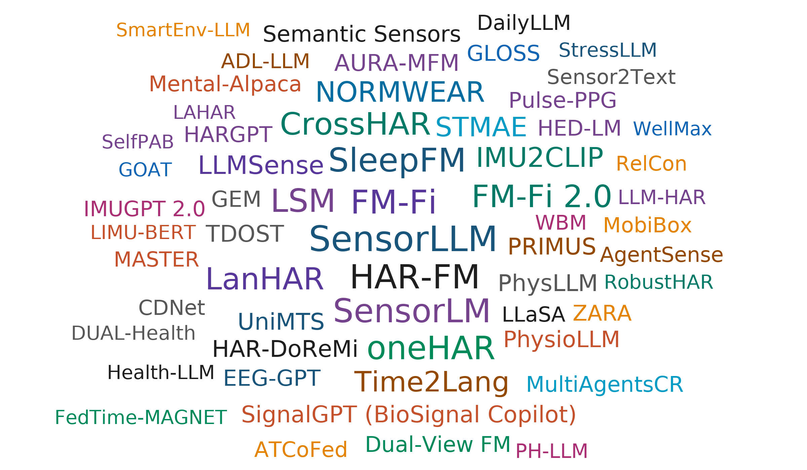

# Foundation-Models-in-the-Area-of-Human-Activity-Recognition
## (continue updating ...)

> This repository aims to provide a curated, continuously updated index of foundation models (FMs) in the human activity recognition (HAR) domain. The organization follows our survey’s lifecycle-based taxonomy and major development directions.

## The brief history of sensor-based HAR

    

Historical development of sensor-based Human Activity Recognition (HAR) models. From classical machine learning with hand-crafted features and shallow classifiers to the rise of deep learning with CNNs and RNNs, the field progressed toward a phase focused on transfer and domain generalization (robustness across users, devices, and datasets). More recently, self-supervised learning (SSL) approaches have enabled pretraining on unlabeled sensor data using contrastive or masked objectives. Today, the field is moving toward foundation models, exemplified by large-scale sensor–language alignment, emphasizing scalability, generalization, and interpretability

## The Trends of FMs for HAR

Here are the growth trends of publications since 2022 and the model names cloud:

  
   

**Left**: HAR-FM papers showing a sharp acceleration with the vast majority of works emerging since 2024.

**Right**: Representative model name cloud.

## Table of Contents 

- [Major Directions](#major-directions)
    - [Developing HAR-Specific Foundation Models from Scratch](#developing-har-specific-foundation-models-from-scratch)
    - [Adapting General Time-Series and Multimodal Foundation Models to HAR](#adapting-general-time-series-and-multimodal-foundation-models-to-har)
    - [Leveraging Large Language Models for Human Activity Recognition](#leveraging-large-language-models-for-human-activity-recognition)

- [Datasets Applied in FM Pretraining and Downstream Tasks](#datasets-applied-in-fm-pretraining-and-downstream-tasks)
    - [IMU-Only Datasets](#imu-only-datasets)
    - [Multimodal Datasets](#multimodal-datasets)
    - [Physiology Datasets](#physiology-datasets)
    - [Smart Home Datasets](#smart-home-datasets)
    - [RF Datasets](#rf-datasets)

- [Base Architecture](#base-architecture)
    - [Encoder-only stacks](#encoder-only-stacks)
    - [Dual-encoder](#dual-encoder)
    - [Encoder-decoder stacks](#encoder-decoder-stacks)
    - [Language-model stacks](#language-model-stacks)

- [Modality Scope](#modality-scope)
  - [Unimodal foundation models](#unimodal-foundation-models)
  - [Multimodal foundation models](#multimodal-foundation-models)
  - [Cross-modal foundation models](#cross-modal-foundation-models)

- [Data Landscape: Collected and Generated Corpora](#data-landscape-collected-and-generated-corpora)
  - [Corpora of sensor data collected in the wild](#corpora-of-sensor-data-collected-in-the-wild)
  - [Generated datasets and augmentation](#generated-datasets-and-augmentation)

- [Tokenization and Representation Strategies](#tokenization-and-representation-strategies)
  - [Window-based and patch-level segmentation](#window-based-and-patch-level-segmentation)
  - [Feature-based aggregation and statistical embeddings](#feature-based-aggregation-and-statistical-embeddings)
  - [Spectrogram and frequency-domain embeddings](#spectrogram-and-frequency-domain-embeddings)
  - [Discrete and quantized sensor tokens](#discrete-and-quantized-sensor-tokens)
  - [Multimodal alignment and positional encoding](#multimodal-alignment-and-positional-encoding)
  - [Token fusion and cross-modal projection](#token-fusion-and-cross-modal-projection)

- [Pretraining Paradigms](#pretraining-paradigms)
  - [Contrastive pretraining](#contrastive-pretraining)
  - [Generative pretraining](#generative-pretraining)
  - [Hybrid and self-supervised pretraining](#hybrid-and-self-supervised-pretraining)

- [Adaptation Strategies](#adaptation-strategies)
  - [Parameter-efficient fine-tuning (PEFT)](#parameter-efficient-fine-tuning-peft)
  - [Full or partial fine-tuning](#full-or-partial-fine-tuning)
  - [Instruction-tuning & alignment](#instruction-tuning--alignment)

- [Downstream Capabilities](#downstream-capabilities)
  - [Zero-/few-shot & open-set recognition](#zero-few-shot--open-set-recognition)
  - [Cross-dataset / cross-device / cross-user generalization](#cross-dataset--cross-device--cross-user-generalization)
  - [Cross-modal retrieval and search](#cross-modal-retrieval-and-search)
  - [Language-grounded captioning, Q&A, and reasoning](#language-grounded-captioning-qa-and-reasoning)
  - [Generative reconstruction, forecasting, and imputation](#generative-reconstruction-forecasting-and-imputation)
  - [On-device, federated, and online adaptation](#on-device-federated-and-online-adaptation)

- [Deployment Settings](#deployment-settings)
  - [Cloud-scale training and centralized evaluation](#cloud-scale-training-and-centralized-evaluation)
  - [On-device and mobile execution](#on-device-and-mobile-execution)

- [Application Domains](#application-domains)
  - [General-purpose HAR / ADL](#general-purpose-har--adl)
  - [Healthcare & wellbeing](#healthcare--wellbeing)
  - [Smart-home & context-aware environments](#smart-home--context-aware-environments)
  - [Interactive & agentic assistants](#interactive--agentic-assistants)

## Major Directions

### Developing HAR-Specific Foundation Models from Scratch
1. **"A Novel Human Activity Recognition Framework Based on Pre-Trained Foundation Model (Chronos HAR Adapters)"**. *Xiong et al..* IEEE BIBM 2024. [[Paper](https://doi.org/10.1109/BIBM57916.2024.10240605)]
2. **"Self-supervised Learning for Human Activity Recognition Using 700,000 Person-days of Wearable Data"**. *Yuan et al..* npj Digital Medicine 2024. [[Paper](https://doi.org/10.1038/s41746-024-01062-3)]
3. **"Scaling Wearable Foundation Models"**. *Narayanswamy et al..* arXiv 2024. [[Paper](https://arxiv.org/abs/2410.13638v1)]
4. **"RelCon: Relative Contrastive Learning for a Motion Foundation Model for Wearable Data"**. *Xu et al..* ICLR 2025. [[Paper](https://arxiv.org/abs/2411.18822v5)]
5. **"HAR-DoReMi: Optimizing Data Mixture for Self-Supervised Human Activity Recognition Across Heterogeneous IMU Datasets"**. *Ban et al..* arXiv 2025. [[Paper](https://arxiv.org/abs/2503.13542)]
6. **"Beyond Sensor Data: Foundation Models of Behavioral Data from Wearables Improve Health Predictions"**. *Erturk et al..* arXiv 2025. [[Paper](https://arxiv.org/abs/2507.00191)]
7. **"LIMU-BERT: Unleashing the Potential of Unlabeled Data for IMU Sensing Applications"**. *Xu et al..* SenSys 2021. [[Paper](https://dl.acm.org/doi/10.1145/3485730.3485937)]
8. **"Cosmo: Contrastive Fusion Learning with Small Data for Multimodal Human Activity Recognition"**. *Ouyang et al..* MobiCom 2022. [[Paper](https://doi.org/10.1145/3495243.3560519)]
9. **"Spatial-Temporal Masked Autoencoder for Multi-Device Wearable Human Activity Recognition (STMAE)"**. *Miao et al..* IMWUT 2024. [[Paper](https://doi.org/10.1145/3631415)]
10. **"CrossHAR: Generalizing Cross-dataset Human Activity Recognition via Hierarchical Self-Supervised Pretraining"**. *Hong et al..* IMWUT 2024. [[Paper](https://doi.org/10.1145/3659597)]
11. **"Pulse-PPG: An Open-Source Field-Trained PPG Foundation Model for Wearable Applications across Lab and Field Settings"**. *Saha et al..* IMWUT 2025. [[Paper](https://doi.org/10.1145/3749494)]
12. **"RobustHAR: Multi-scale Spatial-temporal Masked Self-supervised Pre-training for Robust Human Activity Recognition"**. *Liu et al..* IJCAI 2025. [[Paper](https://doi.org/10.24963/ijcai.2025/952)]
13. **"Towards Customizable Foundation Models for Human Activity Recognition with Wearable Devices"**. *Minghui Qiu et al.* IMWUT 2025. [[Paper](https://dl.acm.org/doi/10.1145/3749479)]

    
### Adapting General Time-Series and Multimodal Foundation Models to HAR
1. **"A Novel Human Activity Recognition Framework Based on Pre-Trained Foundation Model"**. *Fuhai Xiong et al.* BIBM 2024. [[Paper](https://ieeexplore.ieee.org/document/10822159)]
2. **"Inertial Signal Forecasting with Foundation Model Techniques (Dual-View FM)"**. *Wieland & Pankratius.* IEEE Sensors Journal 2025 (accepted). [[Paper](https://sites.google.com/view/victorpankratius/publications)]
3. **"IMU2CLIP: Multimodal Contrastive Learning for IMU Motion Sensors from Egocentric Videos and Text Narrations"**. *Moon et al..* EMNLP Findings 2023. [[Paper](https://aclanthology.org/2023.findings-emnlp.883/)]
4. **"Weak-Annotation of HAR Datasets using Vision Foundation Models"**. *Bock et al..* ISWC 2024. [[Paper](https://dl.acm.org/doi/10.1145/3675095.3676613)]
5. **"GOAT: A Generalized Cross-Dataset Activity Recognition Framework with Natural Language Supervision"**. *Miao & Chen.* IMWUT 2024. [[Paper](https://dl.acm.org/doi/10.1145/3699736)]
6. **"GEM: Empowering MLLM for Grounded ECG Understanding with Time Series and Images"**. *Lan et al..* arXiv 2025. [[Paper](https://arxiv.org/abs/2503.06073)]
7. **"UniMTS: Unified Pre-training for Motion Time Series"**. *Zhang et al..* NeurIPS 2024. [[Paper](https://arxiv.org/abs/2410.19818)]
8. **"Time2Lang: Bridging Time‑Series Foundation Models and Large Language Models for Health Sensing"**. *Pillai et al..* PMLR 2025. [[Paper](https://proceedings.mlr.press/v287/pillai25a.html)]

### Leveraging Large Language Models for Human Activity Recognition
1. **"LanHAR: Language-centered Human Activity Recognition"**. *Yan et al..* arXiv 2025. [[Paper](https://arxiv.org/abs/2410.00003)]
2. **"SensorLLM: Aligning Large Language Models with Motion Sensors for Human Activity Recognition"**. *Li et al..* arXiv 2025. [[Paper](https://arxiv.org/abs/2410.10624)]
3. **"Time2Lang: Bridging Time-Series Foundation Models and Large Language Models for Health Sensing Beyond Prompting"**. *Pillai et al..* CHIL (PMLR) 2025. [[Paper](https://proceedings.mlr.press/v287/pillai25a.html)]
4. **"DailyLLM: Context-Aware Activity Log Generation Using Multi-Modal Sensors and LLMs"**. *Tian et al..* arXiv 2025. [[Paper](https://arxiv.org/abs/2507.13737)]
5. **"ContextLLM: Meaningful Context Reasoning from Multi-Sensor and Multi-Device Data Using LLMs"**. *Post et al..* HotMobile 2025. [[Paper](https://dl.acm.org/doi/10.1145/3708468.3711892)]
6. **"HARGPT: Are LLMs Zero-Shot Human Activity Recognizers?"**. *Ji et al..* arXiv 2024. [[Paper](https://arxiv.org/abs/2403.02727)]
7. **"LLaSA: Large Multimodal Agent for Human Activity Analysis Through Wearable Sensors"**. *Imran et al..* arXiv 2024. [[Paper](https://arxiv.org/abs/2406.14498)]
8. **"StressLLM: Large Language Models for Stress Prediction via Wearable Sensor Data"**. *Thapa et al..* IEEE ICCE 2025. [[Paper](https://doi.org/10.1109/ICCE63647.2025.10929774)]
9. **"SensorLM: Learning the Language of Wearable Sensors"**. *Zhang et al..* arXiv 2025. [[Paper](https://arxiv.org/abs/2506.09108)]
10. **"Sensor2Text: Enabling Natural Language Interactions for Daily Activity Tracking Using Wearable Sensors"**. *Chen et al..* IMWUT 2024. [[Paper](https://doi.org/10.1145/3699747)]

## Datasets Applied in FM Pretraining and Downstream Tasks

### IMU-only Datasets
| Dataset | Sensors | Datasize | Subjects | Activities |
|:--|:--|:--|:--|:--|
| [**CAPTURE-24**](https://www.nature.com/articles/s41597-024-03960-3) | acc | 3883 h | 151 | 200 unique labels |
| [**TNDA-HAR**](https://ieee-dataport.org/open-access/tnda-har-0) | acc, gyro | 5.7 h | 23 | 8 daily activities |
| [**HAR70+**](https://archive.ics.uci.edu/dataset/780/har70) | acc | 12.6 h | 18 | 8 daily activities |
| [**WISDM**](https://archive.ics.uci.edu/dataset/507/wisdm%2Bsmartphone%2Band%2Bsmartwatch%2Bactivity%2Band%2Bbiometrics%2Bdataset) | acc, gyro | 91.8 h | 51 | 18 daily activities |
| [**MotionSense**](https://github.com/mmalekzadeh/motion-sense) | acc, gyro | — | 24 | 6 daily activities |
| [**SHL Challenge**](http://www.shl-dataset.org/challenges/) | acc, gyro, mag | 2812 h | 3 | 8 transport modes |
| [**Shoaib**](https://www.utwente.nl/en/eemcs/ps/research/dataset/) | acc, gyro, mag | 6.5 h | 10 | 13 daily activities |
| [**HHAR**](https://archive.ics.uci.edu/ml/datasets/heterogeneity%2Bactivity%2Brecognition) | acc, gyro | — | 9 | 6 daily activities |
| [**WHARF**](https://github.com/fulviomas/WHARF) | acc | — | 16 | 8 motion primitives |
| [**DSADS**](https://archive.ics.uci.edu/dataset/256/daily%2Band%2Bsports%2Bactivities) | acc, gyro, mag | 12.7 h | 8 | 19 daily/sports activities |
| [**UCI-HAR**](https://archive.ics.uci.edu/dataset/240/human%2Bactivity%2Brecognition%2Busing%2Bsmartphones) | acc, gyro | — | 30 | 6 daily activities |
| [**USC-HAD**](https://sipi.usc.edu/had/) | acc, gyro, mag | — | 14 | 12 daily activities |
| [**Daphnet FoG**](https://archive.ics.uci.edu/dataset/245/daphnet%2Bfreezing%2Bof%2Bgait) | acc | 8.3 h | 10 | 3 walking activities |
| [**HAPT**](https://archive.ics.uci.edu/dataset/341/smartphone%2Bbased%2Brecognition%2Bof%2Bhuman%2Bactivities%2Band%2Bpostural%2Btransitions) | acc, gyro | — | 30 | 6 static, dynamic activities |
| [**REALDISP**](https://archive.ics.uci.edu/dataset/305/realdisp%2Bactivity%2Brecognition%2Bdataset) | acc, gyro, mag | — | 17 | 33 daily, fitness activities |
| [**UniMiB SHAR**](https://www.sal.disco.unimib.it/technologies/unimib-shar/) | acc | — | 30 | 17 daily, fall activities |
| [**UMAFall**](https://figshare.com/articles/dataset/UMA_ADL_FALL_Dataset_zip/4214283) | acc, gyro, mag | 2.2 h | 17 | 11 daily, fall activities |
| [**MobiAct**](https://bmi.hmu.gr/the-mobifall-and-mobiact-datasets-2/) | acc, gyro | — | 57 | 13 daily, fall activities |
| [**Skoda Mini Checkpoint**](http://har-dataset.org/lib/exe/fetch.php?media=wiki:dataset:skodaminicp:skodaminicp_2015_08.zip) | acc (3D) | — | 1 | 10 assembly-line activities |

### IMU+ Multimodal Datasets
| Dataset | Sensors | Datasize | Subjects | Activities |
|:--|:--|:--|:--|:--|
| [**RecGym**](https://www.kaggle.com/datasets/zhaxidelebsz/10-gym-exercises-with-615-abstracted-features) | acc, gyro, human body capacitance | 50h | 10 | 12 fitness activities |
| [**WEAR**](https://mariusbock.github.io/wear/) | acc, video | 19 h | 22 | 18 sports activities |
| [**iSPL**](https://github.com/thunguyenth/HAR_IMU_Stretch) | acc, gyro, stretch | — | 1 | 9 daily activities |
| [**HARTH**](https://archive.ics.uci.edu/dataset/779/harth) | acc, video | 35.9 h | 22 | 12 daily activities |
| [**w-HAR**](https://github.com/gmbhat/human-activity-recognition) | acc, gyro, stretch | 3 h | 22 | 7 daily activities |
| [**RealLifeHAR**](https://lbd.udc.es/research/real-life-HAR-dataset/) | acc, gyro, mag, GPS | — | 19 | 4 daily activities |
| [**MMAct**](https://mmact19.github.io/2019/) | RGB, keypoints, acc, gyro, ori, Wi‑Fi, pressure | — | 40 | 37 activities |
| [**HuGaDB**](https://github.com/romanchereshnev/HuGaDB) | acc, gyro, EMG | 10 h | 18 | 12 activities |
| [**RealWorld HAR**](https://www.uni-mannheim.de/dws/research/projects/activity-recognition/dataset/dataset-realworld/) | acc, gyro, mag, GPS, light, sound level | 124.3 h | 15 | 8 daily activities |
| [**ExtraSensory**](http://extrasensory.ucsd.edu/) | acc, gyro, mag, location, audio, additional | — | 60 | 51 activities |
| [**UTD-MHAD**](https://personal.utdallas.edu/~kehtar/UTD-MHAD.html) | RGB, depth, skeleton, acc, gyro | — | 8 | 27 activities |
| [**MHEALTH**](https://archive.ics.uci.edu/dataset/319/mhealth+dataset) | acc, gyro, mag, ECG | — | 10 | 12 daily activities |
| [**Berkeley MHAD**](https://ieeexplore.ieee.org/document/6474999) | acc, optical capture, video, depth, audio | 1.37 h | 12 | 11 daily activities |
| [**PAMAP2**](https://archive.ics.uci.edu/dataset/231/pamap2%2Bphysical%2Bactivity%2Bmonitoring) | acc, gyro, mag, HR | 10 h | 9 | 18 daily activities |
| [**Opportunity**](https://archive.ics.uci.edu/dataset/226/opportunity%2Bactivity%2Brecognition) | acc, gyro, mag, ambient sensors | 25 h | 4 | 9 kitchen + 9 gestures |
| [**MRI**](https://github.com/sizhean/mri) | mmWave, RGB-D, IMU | 5.3 h | 20 | pose estimation | 
| [**NORMWEAR**](https://github.com/Mobile-Sensing-and-UbiComp-Laboratory/NormWear?tab=readme-ov-file)  | PPG, ECG, EEG, GSR, IMU | 14,943 h | 20 | pose estimation | 
| **SensorLM** [[Paper](https://arxiv.org/abs/2506.09108) ] | PPG, EDA, ACC, TEMP, ALT | 59,749 h | 103,731 | sensor-language study | 
| **Apple Study (AHMS; WBM)** [[Paper](https://arxiv.org/html/2507.00191v1)]  | HealthKit metrics (27) | > 2.5 B h | 162 K | 57 health tasks | 
| [**WESAD**](https://archive.ics.uci.edu/dataset/465/wesad+wearable+stress+and+affect+detection)  | EDA/PPG/Temp + Acc | 45 h | 15 | stress detection | 
| [**PPG-Dalia**](https://archive.ics.uci.edu/dataset/495/ppg+dalia)  | ECG, PPG, IMU, GSR | 36 h | 15 | daily activities | 

### Physiology Datasets
| Dataset | Sensors | Datasize | Subjects | Activities |
|:--|:--|:--|:--|:--|
| [**Sleep-EDF**](https://www.physionet.org/content/sleep-edfx/1.0.0/) | EEG/EOG/EMG/ECG | 1,576 h | 197 | sleep stages |
| [**MIT-BIH Arrhythmia**](https://physionet.org/content/mitdb/1.0.0/) | 2‑lead ECG | 1128 h | 47 | ambulatory ECG |
| [**PTB-XL**](https://physionet.org/content/ptb-xl/1.0.3/) | 12‑lead ECG | 6.06 h | 18,885 | ECG status |
| [**TUH EEG**](https://isip.piconepress.com/projects/tuh_eeg/) | multi‑channel EEG | 1476 h | 675 | seizure activity |
| [**Cuff‑Less‑BP**](https://archive.ics.uci.edu/dataset/340/cuff+less+blood+pressure+estimation) | ECG, PPG | 72 h | — | blood‑pressure estimation |
| [**Auditory‑EEG**](https://physionet.org/content/auditory-eeg/1.0.0/) | EEG | 23 h | — | auditory attention |
| [**PhyAAt**](https://phyaat.github.io/dataset)| EEG | 33 h | 25 | auditory attention |
| [**MAUS**](https://github.com/rickwu11/MAUS_dataset_baseline_system?tab=readme-ov-file) | ECG, PPG, GSR | 22 h | 22 | cognitive workload/stress |
| [**Mendeley‑YAAD**](https://data.mendeley.com/datasets/g2p7vwxyn2/4) | ECG, GSR | 5 h | — | affect/stress elicitation |
| [**Brain‑Cognitive**](https://www.physionet.org/content/brain-wearable-monitoring/1.0.0/) | EEG | 85 h | 20 | cognitive state regulation |
| [**EPHNOGRAM**](https://physionet.org/content/ephnogram/1.0.0/) | ECG, PCG | 61 h | 24 | cardiac auscultation |
| [**BIDMC**](https://physionet.org/content/bidmc/1.0.0/) | ECG, PPG | 14 h | 53 | clinical monitoring |
| **MOODS** [[Paper](https://arxiv.org/html/2502.01108v1)] | PPG | 54 K h | 122 | stress monitoring |
| [**SleepFM**](https://github.com/rthapa84/sleepfm-codebase?tab=readme-ov-file) | BAS, ECG, respiratory | 112,544 h | 14,068 | sleep quality monitoring |
| [**RecGym**](https://www.kaggle.com/datasets/zhaxidelebsz/10-gym-exercises-with-615-abstracted-features) | acc, gyro, human body capacitance | 50h | 10 | 12 fitness activities |
| [**PPG-Dalia**](https://archive.ics.uci.edu/dataset/495/ppg+dalia)  | ECG, PPG, IMU, GSR | 36 h | 15 | daily activities | 

### Smart Home Datasets
| Dataset | Sensors | Datasize | Subjects | Activities | 
|:--|:--|:--|:--|:--| 
| [**CASAS (Aruba/Milan/...)**](https://casas.wsu.edu/datasets/) | Ambient binary sensors (motion, doors) | — | — | smart home activities |

### RF Datasets
| Dataset | Sensors | Datasize | Subjects | Activities | 
|:--|:--|:--|:--|:--| 
| **mmWave (var.)**[[Paper](https://dl.acm.org/doi/abs/10.1145/3666025.3699349)] | Range–Doppler / RF point clouds | 5 h | 10 | daily activities (10 scenes) |
| [**MM-Fi**](https://github.com/ybhbingo/MMFi_dataset) | mmWave, LiDAR, Wi‑Fi, RGB‑D | 10.6 h | 40 | 27 daily activities |

## Base Architecture

### Encoder-only stacks
1. **"A Novel Human Activity Recognition Framework Based on Pre‑Trained Foundation Model (Chronos HAR Adapters)"**. *Xiong et al..* IEEE BIBM 2024. [[Paper](https://doi.org/10.1109/BIBM57916.2024.10240605)]
2. **"Beyond Sensor Data: Foundation Models of Behavioral Data from Wearables Improve Health Predictions"**. *Erturk et al..* ICML 2025. [[Paper](https://arxiv.org/abs/2507.00191)]
3. **"Cosmo: Contrastive Fusion Learning with Small Data for Multimodal Human Activity Recognition"**. *Ouyang et al..* MobiCom 2022. [[Paper](https://dl.acm.org/doi/10.1145/3496968.3497015)]
4. **"CrossHAR: Generalizing Cross‑dataset Human Activity Recognition via Hierarchical Self‑Supervised Pretraining"**. *Hong et al..* IMWUT 2024. [[Paper](https://doi.org/10.1145/3631234)]
5. **"HAR‑DoReMi: Optimizing Data Mixture for Self‑Supervised Human Activity Recognition Across Heterogeneous IMU Datasets"**. *Ban et al..* arXiv 2025. [[Paper](https://arxiv.org/abs/2503.01234)]
6. **"Layout‑Agnostic Human Activity Recognition in Smart Homes through Textual Descriptions Of Sensor Triggers (TDOST)"**. *Thukral et al..* IMWUT 2025. [[Paper](https://dl.acm.org/doi/10.1145/3712278)]
7. **"LIMU‑BERT: Unleashing the Potential of Unlabeled Data for IMU Sensing Applications"**. *Xu et al..* SenSys 2021. [[Paper](https://dl.acm.org/doi/10.1145/3485730.3485783)]
8. **"MASTER: A Multi‑modal Foundation Model for Human Activity Recognition"**. *Zhu et al..* IMWUT 2025. [[Paper](http://dx.doi.org/10.1145/3749511)]
9. **"Pulse‑PPG: An Open‑Source Field‑Trained PPG Foundation Model for Wearable Applications across Lab and Field Settings"**. *Saha et al..* IMWUT 2025. [[Paper](https://doi.org/10.1145/3786408.3811654)]
10. **"RelCon: Relative Contrastive Learning for a Motion Foundation Model for Wearable Data"**. *Xu et al..* ICLR 2025. [[Paper](https://arxiv.org/abs/2411.18822v5)]
11. **"Self‑Supervised Learning for Human Activity Recognition Using 700,000 Person‑days of Wearable Data"**. *Yuan et al..* npj Digital Medicine 2024. [[Paper](https://doi.org/10.1038/s41746-024-01062-3)]
12. **"SelfPAB: Large‑Scale Pre‑training on Accelerometer Data for Human Activity Recognition"**. *Logacjov et al..* Applied Intelligence 2024. [[Paper](https://doi.org/10.1007/s10489-024-05322-3)]
13. **"Speech Foundation Models Generalize to Time Series Tasks from Wearable Sensor Data"**. *Narain et al..* arXiv 2025. [[Paper](https://arxiv.org/abs/2509.00221v1)]
14. **"Towards Customizable Foundation Models for Human Activity Recognition with Wearable Devices (HAR‑FM)"**. *Qiu et al..* IMWUT 2025. [[Paper](http://dx.doi.org/10.1145/3749479)]

### Dual-encoder
1. **"FM-Fi 2.0: Foundation Model for Cross-Modal Multi-Person Human Activity Recognition"**. *Weng et al..* IEEE TMC 2025. [[Paper](https://doi.org/10.1109/TMC.2025.3593406)]
2. **"IMU2CLIP: Multimodal Contrastive Learning for IMU Motion Sensors from Egocentric Videos and Text Narrations"**. *Moon et al..* EMNLP 2023. [[Paper](https://aclanthology.org/2023.findings-emnlp.883/)]
3. **"Inertial Signal Forecasting with Foundation Model Techniques (Dual-View FM)"**. *Wieland et al..* Sensors 2025. [[Paper](https://doi.org/10.3390/s25030834)]
4. **"Large Model for Small Data: Foundation Model for Cross-Modal RF Human Activity Recognition (FM-Fi)"**. *Weng et al..* SenSys 2024. [[Paper](https://doi.org/10.1145/3589132.3625578)]
5. **"Limitations in Employing Natural Language Supervision for Sensor-Based Human Activity Recognition – And Ways to Overcome Them"**. *Haresamudram et al..* AAAI 2025.
6. **"Multimodal Foundation Model for Cross-Modal Retrieval and Activity Recognition (AURA-MFM)"**. *Matsuishi et al..* arXiv 2025. [[Paper](https://arxiv.org/abs/2506.03174)]
7. **"PRimuS: Pretraining IMU Encoders with Multimodal Self-Supervision"**. *Das et al..* ICASSP 2025.
8. **"SensorLM: Learning the Language of Wearable Sensors"**. *Zhang et al..* arXiv 2025. [[Paper](https://arxiv.org/abs/2506.09108)]
9. **"SleepFM: Multi-modal Representation Learning for Sleep Across Brain Activity, ECG and Respiratory Signals"**. *Thapa et al..* arXiv 2024. [[Paper](https://arxiv.org/abs/2405.17766v1)]
10. **"Toward Foundation Model for Multivariate Wearable Sensing of Physiological Signals (NORMWEAR)"**. *Luo et al..* arXiv 2025.
11. **"UniMTS – Unified Pre-training for Motion Time-Series"**. *Zhang et al..* NeurIPS 2024. [[Paper](https://openreview.net/forum?id=NeurIPS2024-UniMTS)]
12. **"Weak-Annotation of HAR Datasets using Vision Foundation Models"**. *Bock et al..* ISWC 2024.
13. **"Gem: Empowering mllm for grounded ecg understanding with time series and images"**. *Xiang Lan et al.* Arxiv 2025. [[Paper](https://arxiv.org/abs/2503.06073)]

    
### Encoder-decoder stacks
1. **"LSM: Large-Scale Masked Modeling of Daily Summaries for Population-Level Behavior Modeling"**. *—.* arXiv 2025. [[Paper](https://arxiv.org/abs/2506.09010)]
2. **"NORMWEAR: Normalization-Enhanced Pretraining of Physiological Signals for Wearable Sensing"**. *Luo et al..* arXiv 2025. [[Paper](https://arxiv.org/abs/2505.02512)]
3. **"RobustHAR: Multi-scale Spatial-temporal Masked Self-supervised Pre-training for Robust Human Activity Recognition"**. *Liu et al..* IMWUT 2025.
4. **"Scaling Wearable Foundation Models"**. *Narayanswamy et al..* ARXIV 2024.
5. **"SelfPAB: Large-Scale Pre-training on Accelerometer Data for Human Activity Recognition"**. *Logacjov et al..* — 2024.
6. **"Sensor2Text: Enabling Natural Language Interactions for Daily Activity Tracking Using Wearable Sensors"**. *Chen et al..* IMWUT 2024. [[Paper](https://dl.acm.org/doi/10.1145/3699747)]
7. **"SensorLM: Learning the Language of Wearable Sensors"**. *Zhang et al..* arXiv 2025. [[Paper](https://arxiv.org/abs/2506.09108)]
8. **"Spatial-Temporal Masked Autoencoder for Multi-Device Wearable Human Activity Recognition (STMAE)"**. *Miao et al..* IMWUT 2023.
9. **"STMAE: Structured Temporal Masked Autoencoding for Sensor Reconstruction"**. *—.* arXiv 2024. [[Paper](https://arxiv.org/abs/2405.02541)]
10. **"Toward Foundation Model for Multivariate Wearable Sensing of Physiological Signals (NORMWEAR)"**. *Luo et al..* ARXIV 2025.

### Language-model stacks
1. **"SensorLM: Learning the Language of Wearable Sensors"**. *Zhang et al..* arXiv 2025. [[Paper](https://arxiv.org/abs/2506.09108)]
2. **"Time2Lang: Bridging Time‑Series Foundation Models and Natural Language"**. *Pillai et al..* PMLR 2025. [[Paper](https://proceedings.mlr.press/v287/pillai25a.html)]
3. **"SensorLLM: Aligning Large Language Models with Motion Sensors for Human Activity Recognition"**. *Li et al..* arXiv 2024. [[Paper](https://arxiv.org/abs/2410.10624)]
4. **"LLaSA: A Multimodal LLM for Human Activity Analysis Through Wearable and Smartphone Sensors"**. *Imran et al..* arXiv 2024. [[Paper](https://arxiv.org/abs/2406.14498)]
5. **"HARGPT: A Language‑Conditioned Foundation Model for Human Activity Recognition"**. *Ji et al..* arXiv 2024. [[Paper](https://arxiv.org/abs/2403.19526)]
6. **"LanHAR: Language‑Driven Human Activity Recognition"**. *Yan et al..* arXiv 2024. [[Paper](https://arxiv.org/abs/2410.00003)]
7. **"StressLLM: Large Language Models for Wearable Stress Detection"**. *Thapa et al..* arXiv 2025. [[Paper](https://arxiv.org/abs/2506.04817)]
8. **"DailyLLM: Large Language Models for Daily Behavior Understanding"**. *Kang et al..* arXiv 2025. [[Paper](https://arxiv.org/abs/2505.04563)]
9. **"ContextLLM: Multimodal Context Understanding from Wearable Devices"**. *Wang et al..* arXiv 2025. [[Paper](https://arxiv.org/abs/2506.07114)]
10. **"Health‑LLM: Aligning Large Language Models with Wearable Sensor Health Data"**. *Liu et al..* Information Fusion 2025. [[Paper](https://doi.org/10.1016/j.inffus.2025.103403)]
11. **"SensorGPT: Generative Pretraining for Wearable Sensing"**. *Sharma et al..* arXiv 2025. [[Paper](https://arxiv.org/abs/2504.06512)]
12. **"Sensor2Text: Enabling Natural Language Interactions for Daily Activity Tracking Using Wearable Sensors"**. *Chen et al..* IMWUT 2024. [[Paper](https://doi.org/10.1145/3699747)]

## Modality Scope

###  Unimodal foundation models
1. **"RelCon: Relative Contrastive Learning for a Motion Foundation Model for Wearable Data"**. *Xu et al.* ICLR 2025. [[Paper](https://arxiv.org/abs/2411.18822)]  
2. **"oneHAR: Universal IMU-based Human Activity Recognition with LLM-assisted Cross-Dataset Representation"**. *Wei et al.* IMWUT 2025. [[Paper](https://doi.org/10.1145/3749509)]  
3. **"SelfHAR-700k: Self-Supervised Learning for Human Activity Recognition Using 700,000 Person-Days of Wearable Data"**. *Yuan et al.* npj Digital Medicine 2024. [[Paper](https://www.nature.com/articles/s41746-024-01062-3)]  
4. **"Pulse-PPG: An Open-Source Field-Trained PPG Foundation Model for Wearable Applications"**. *Saha et al.* IMWUT 2025. [[Paper](https://doi.org/10.1145/3749494)]  

###  Multimodal foundation models
1. **"HAR-FM: A Multimodal Foundation Model for Human Activity Recognition"**. *Qiu et al.* arXiv 2025. [[Paper](https://arxiv.org/abs/2509.10729v1)]  
2. **"MASTER: Multimodal Activity Sensing with Transformer Encoders and Representation Alignment"**. *Zhu et al.* IEEE TMC 2025. [[Paper](https://doi.org/10.1109/TMC.2025.3623501)]  
3. **"NORMWEAR: Toward Foundation Models for Multivariate Wearable Sensing of Physiological Signals"**. *Luo et al.* arXiv 2024. [[Paper](https://arxiv.org/abs/2412.09758)]  
4. **"MuJo: Multimodal Joint Feature Space Learning for Human Activity Recognition"**. *Fritsch et al.* arXiv 2024. [[Paper](https://arxiv.org/abs/2406.03857)]  

###  Cross-modal foundation models
1. **"SensorLM: Learning the Language of Wearable Sensors"**. *Zhang et al.* arXiv 2025. [[Paper](https://arxiv.org/abs/2506.09108)]  
2. **"SensorLLM: Aligning Large Language Models with Motion Sensors for Human Activity Recognition"**. *Li et al.* arXiv 2024. [[Paper](https://arxiv.org/abs/2410.10624)]  
3. **"IMU2CLIP: Multimodal Contrastive Learning for IMU Motion Sensors from Egocentric Videos and Text Narrations"**. *Moon et al.* EMNLP Findings 2023. [[Paper](https://aclanthology.org/2023.findings-emnlp.883/)]  
4. **"FM-Fi 2.0: Foundation Model for Cross-Modal Multi-Person Human Activity Recognition"**. *Weng et al.* IEEE TMC 2025. [[Paper](https://doi.org/10.1109/TMC.2025.3593406)]  
5. **"HARGPT: Are LLMs Zero-Shot Human Activity Recognizers?"**. *Ji et al.* arXiv 2024. [[Paper](https://arxiv.org/abs/2403.02727)]  

## Data Landscape: Collected and Generated Corpora
  ###  Corpora of sensor data collected in the wild
  ###  Generated datasets and augmentation

## Tokenization and Representation Strategies
  ###  Window-based and patch-level segmentation
  ###  Feature-based aggregation and statistical embeddings
  ###  Spectrogram and frequency-domain embeddings
  ###  Discrete and quantized sensor tokens
  ###  Multimodal alignment and positional encoding
  ###  Token fusion and cross-modal projection

## Base Architectures
  ###  Encoder-only stacks (discriminative encoders)
  ###  Dual encoders (retrieval/alignment)
  ###  Encoder–decoder stacks (conditional generation)
  ###  Language-model stacks (encoder–decoder or decoder-only)

## Pretraining Paradigms
  ###  Contrastive pretraining
  ###  Generative pretraining
  ###  Hybrid and self-supervised pretraining

## Adaptation Strategies
  ###  Parameter-efficient fine-tuning (PEFT)
  ###  Full or partial fine-tuning
  ###  Instruction-tuning & alignment

## Downstream Capabilities
  ###  Zero-/few-shot & open-set recognition
  ###  Cross-dataset / cross-device / cross-user generalization
  ###  Cross-modal retrieval and search
  ###  Language-grounded captioning, Q&A, and reasoning
  ###  Generative reconstruction, forecasting, and imputation
  ###  On-device, federated, and online adaptation

## Deployment Settings
  ###  Cloud-scale training and centralized evaluation
  ###  On-device and mobile execution

## Application Domains
  ###  General-purpose HAR / ADL
  ###  Healthcare & wellbeing
  ###  Smart-home & context-aware environments
  ###  Interactive & agentic assistants

